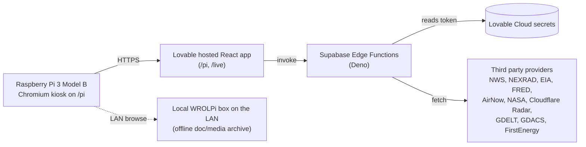

# Plan v3: README rewrite with /pi + /live screenshots

## Route check (from `src/App.tsx`)

```tsx
<Route path="/live" element={<Live />} />
<Route path="/pi" element={<Pi />} />
<Route path="/dashboard" element={<ProtectedRoute><Dashboard /></ProtectedRoute>} />
```

Both `/pi` and `/live` are public (unprotected) and renderable from the browser without auth. `/dashboard` exists but sits behind `ProtectedRoute`, so it will not be referenced in the README per your instruction.

## Screenshot capture

1. `browser--navigate_to_sandbox` to `/pi` at width 1024, height 600 (the 7 inch display target). The viewport tool will snap to the closest supported size (1024x768 is the nearest match; I will note the actual snapped size in the report). If snapping makes the shot misleading I will fall back to 1280x720 and crop to 1024x600 with ImageMagick.
2. Wait for live data: poll `observe` / `screenshot` until no panel shows a skeleton or "loading" state. Specifically check Weather, Outages, Radar, FRED, EIA, Cloudflare Radar tiles all show numbers, not dashes or spinners.
3. Save to `docs/pi-tactical.png`.
4. Repeat for `/live` at 1440x900 (snaps to 1536x864 or 1366x768; I will pick the 1366x768 snap and note actual size). Save to `docs/live.png`.
5. Open both PNGs with `code--view` (or `image_tools--zoom_image` for spot checks) and confirm real data is visible.
6. Report back in chat with: file path, byte size, snapped viewport size, and a one line description of what each shot shows. Will not commit until you confirm.

If a panel is genuinely unavailable (e.g. `power-outages` returns the "feed unavailable" banner during capture), I will note that in the report rather than pretend it's loading.

## Repo state (rechecked)

* HEAD: `b59d81e` — "Increased tile label sizes". Real PrepPi code is in the repo (20 panel components, 12 edge functions, all routes). Not the December 2024 boilerplate.
* `.env` only contains the three publishable `VITE_SUPABASE_*` values. No FRED, EIA, AirNow, NASA, or Cloudflare tokens are committed.

## Files to add or change

1. `README.md` — full rewrite (content below)
2. `docs/pi-tactical.png` — `/pi` screenshot at 1024x600
3. `docs/live.png` — `/live` screenshot at 1440 wide
4. `LICENSE` — MIT
5. `.gitignore` — append `.env.local` and `.env.*.local`

## Final secret hygiene grep (run before declaring done)

```
rg -n "FRED_API_KEY|CLOUDFLARE_RADAR_API_TOKEN|EIA_APP_KEY|AIRNOW_API_KEY|NASA_API_KEY|sk_live|sk_test|Bearer [A-Za-z0-9]{20,}" \
  -g '!node_modules' -g '!*.lock' -g '!*.lockb'
```

Expected: zero hits outside `Deno.env.get(...)` calls inside `supabase/functions/*/index.ts`. Will paste the actual output in chat.

## Source verification table (already audited against shipped code)

Same as v2. Every panel listed in the README maps to a real component file under `src/components/panels/` and either a direct fetch in that component or an edge function under `supabase/functions/`. The deprecated `news-feed` function is omitted.

## Proposed README content

````markdown
# PrepPi

A faith oriented situational awareness and preparedness dashboard built to run on a Raspberry Pi with a 7 inch touch display. It pulls live weather, grid, market, and global signals into one always on console so a household can glance at conditions without doomscrolling.

## Screenshots

| Tactical (`/pi`) | Live wall (`/live`) |
| :: | :: |
|  |  |

`/pi` is the always on layout sized for the 7 inch display (1024 by 600). `/live` is the wider wall view used on a desktop or second monitor.

## What this is

A personal kiosk. One screen, one household, one Pi sitting on a shelf.

## What this isn't

A product. There is no signup flow tuned for strangers, no multi tenant model, no SLA on the data feeds, and no support. Several panels depend on third party endpoints that can change shape or rate limit without warning. Treat this as a reference build, not something to deploy for other people.

## Data sources

Every panel is powered by a public or licensed feed. Credit where it's due.

| Panel | Source |
| :: | :: |
| Severe radar | NEXRAD tiles via Iowa Environmental Mesonet |
| Weather, alerts, hazardous outlook | National Weather Service (api.weather.gov) |
| Air quality | AirNow |
| Earthquakes | USGS |
| Space weather and sun imagery | NOAA SWPC plus NASA SDO |
| NASA flares, CMEs, near earth objects | NASA DONKI and NeoWs |
| Grid load and fuel mix | EIA (PJM demand) |
| Fuel prices and shipping | EIA weekly retail series plus Freightos Baltic Index |
| Financial stress | FRED (St. Louis Fed: STLFSI4, VIXCLS, T10Y2Y, MORTGAGE30US) |
| Power outages | FirstEnergy / Penelec public outage summary |
| Internet health and L7 attacks | Cloudflare Radar |
| Local scanner audio | Broadcastify (Lawrence County feed 33610) |
| Global headlines and conflict pulse | GDELT |
| Active disasters | GDACS |
| National headlines | RSS aggregation |
| Moon phase | Local computation |

## Architecture



The browser never sees a third party API key. Every credentialed call goes through an edge function that reads the token from Lovable Cloud secrets.

## Hardware setup

* Raspberry Pi 3 Model B
* Official 7 inch touch display (1024 by 600)
* MicroSD card with Raspberry Pi OS Lite plus Chromium
* Wall mount or desk stand
* Optional: a local WROLPi box on the LAN for offline reference docs

The Pi boots into Chromium kiosk mode pointed at the deployed `/pi` route.

## Tech stack

* React 18, Vite, TypeScript
* Tailwind CSS, shadcn/ui, Recharts, Leaflet
* Lovable Cloud (managed Supabase) for auth, edge functions, and secret custody
* Supabase Edge Functions in Deno proxy every credentialed third party API
* Built and deployed via Lovable

## Secrets

All third party API keys live in Lovable Cloud secrets and are referenced only from edge functions under `supabase/functions/`. The `.env` in this repo contains only the publishable Supabase URL, project id, and anon key, which are designed to be exposed to the browser. If you fork this, rotate every key on your own account.

## License

MIT. See [LICENSE](LICENSE).

## Acknowledgements

Iowa Environmental Mesonet, National Weather Service, NOAA SWPC, NASA, USGS, EIA, FRED at the Federal Reserve Bank of St. Louis, AirNow, GDELT, GDACS, Cloudflare Radar, Freightos, Broadcastify, FirstEnergy. This dashboard is a thin pane of glass over their work.
````

## Out of scope

No code changes to panels, hooks, edge functions, routes, or styling.
