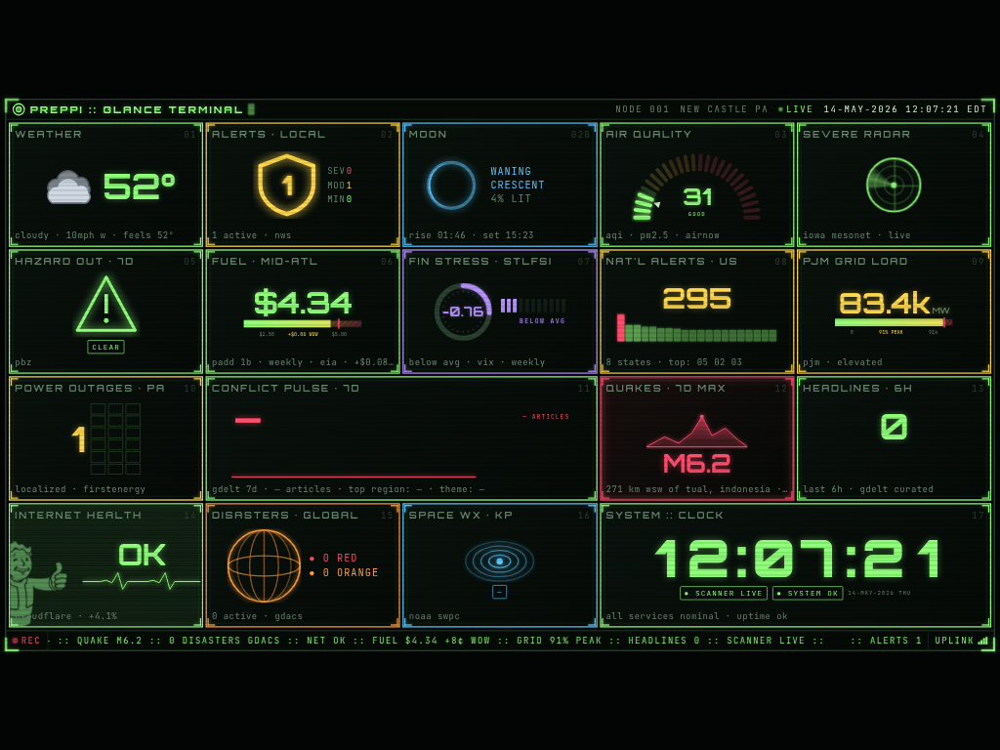
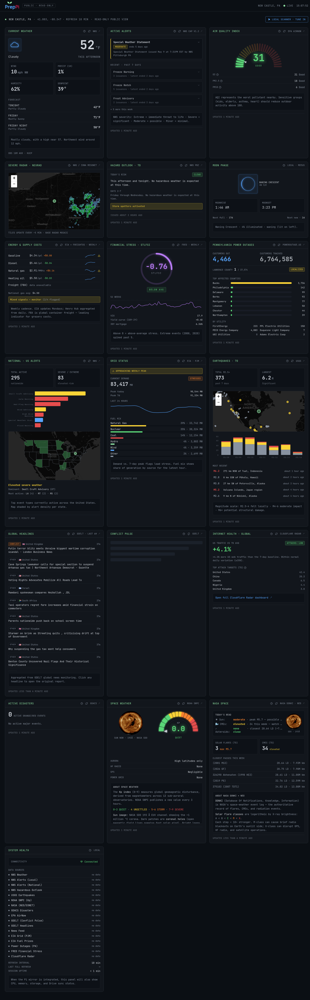
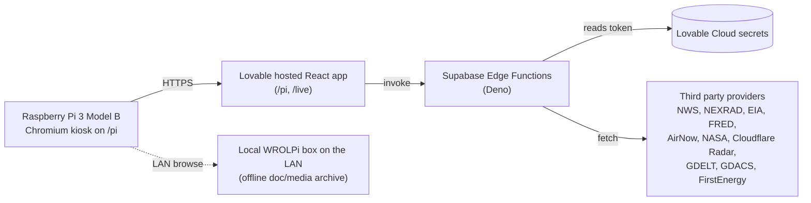

# PrepPi

A household situational awareness kiosk that runs on a Raspberry Pi.

Staying informed about real conditions (weather, the grid, markets, infrastructure, global events) shouldn't require doomscrolling a feed engineered to keep you anxious. PrepPi pulls authoritative public data sources into one calm always on screen so a household can glance, understand, and get on with the day.

It lives on a 7 inch touch display mounted somewhere visible. The `/pi` route is that glance view, sized for the small screen and built to be read across a room. The `/live` route is a wider wall view used on a desktop or second monitor during weather events, news cycles, or anything unusual. The rest of the time the Pi just sits there being quiet and useful.

The "prep" in PrepPi is preparedness in the practical sense: knowing what's happening so a household can make informed decisions. It's not bunker content. It's the same impulse that makes a person check the radar before driving somewhere, scaled up to cover the systems modern life actually depends on.

## Screenshots

| Tactical (`/pi`) | Live wall (`/live`) |
| :: | :: |
|  |  |

`/pi` is the always on layout sized for the 7 inch display at 1024 by 600. `/live` is the wider read only wall view used on a desktop or second monitor.

## What this is

A personal build, calibrated for one household in Western Pennsylvania. The data sources reflect that geography: NWS Pittsburgh, FirstEnergy / Penelec for outages, Lawrence County for scanner audio, PJM for grid load. Anyone forking this for a different region will need to retune those feeds and the map centerpoint.

One screen, one household, one Pi sitting on a shelf.

## What this isn't

A product. There is no signup flow tuned for strangers, no multi tenant model, no SLA on the data feeds, and no support. Several panels depend on third party endpoints that can change shape or rate limit without warning. Treat this as a reference build, not something to deploy for other people.

## How it's used

The Pi runs 24/7 in Chromium kiosk mode on the `/pi` route. It's a glance surface: walk past, read the weather, the grid load, the financial stress index, the outage count, move on.

During weather alerts, severe outlooks, or any cycle worth paying closer attention to, the `/live` route opens on a laptop or second monitor for the deeper read with radar, headlines, conflict signals, and the full set of panels.

The goal is information without anxiety. If the dashboard is doing its job, most days nothing on it demands action.

## Data sources

Every panel is powered by a public or licensed feed. Credit where it's due.

| Panel | Source |
| :: | :: |
| Severe radar | NEXRAD tiles via Iowa Environmental Mesonet |
| Weather, alerts, hazardous outlook | National Weather Service (api.weather.gov) |
| Air quality | AirNow |
| Earthquakes | USGS |
| Space weather and sun imagery | NOAA SWPC plus NASA SDO |
| NASA flares, CMEs, near earth objects | NASA DONKI and NeoWs |
| Grid load and fuel mix | EIA (PJM demand) |
| Fuel prices and shipping | EIA weekly retail series plus Freightos Baltic Index |
| Financial stress | FRED (St. Louis Fed: STLFSI4, VIXCLS, T10Y2Y, MORTGAGE30US) |
| Power outages | FirstEnergy / Penelec public outage summary |
| Internet health and L7 attacks | Cloudflare Radar |
| Local scanner audio | Broadcastify (Lawrence County feed 33610) |
| Global headlines and conflict pulse | GDELT |
| Active disasters | GDACS |
| National headlines | RSS aggregation |
| Moon phase | Local computation |

## Architecture

The browser never sees a third party API key. Every credentialed call goes through an edge function that reads the token from Lovable Cloud secrets at request time.

## Hardware setup

* Raspberry Pi 3 Model B
* Official 7 inch touch display (1024 by 600)
* MicroSD card with Raspberry Pi OS Lite plus Chromium
* Wall mount or desk stand
* Optional: a local WROLPi box on the LAN for offline reference docs

The Pi boots into Chromium kiosk mode pointed at the deployed `/pi` route.

## Tech stack

* React 18, Vite, TypeScript
* Tailwind CSS, shadcn/ui, Recharts, Leaflet
* Lovable Cloud (managed Supabase) for auth, edge functions, and secret custody
* Supabase Edge Functions in Deno proxy every credentialed third party API
* Built and deployed via Lovable

## Secrets

All third party API keys live in Lovable Cloud secrets and are referenced only from edge functions under `supabase/functions/`. The `.env` in this repo contains only the publishable Supabase URL, project id, and anon key, which are designed to be exposed to the browser. If you fork this, rotate every key on your own account.

## License

MIT. See [LICENSE](LICENSE).

## Acknowledgements

Iowa Environmental Mesonet, National Weather Service, NOAA SWPC, NASA, USGS, EIA, FRED at the Federal Reserve Bank of St. Louis, AirNow, GDELT, GDACS, Cloudflare Radar, Freightos, Broadcastify, FirstEnergy. This dashboard is a thin pane of glass over their work.

## About

Built by Reed Verdesoto at [everde.co](https://everde.co).
