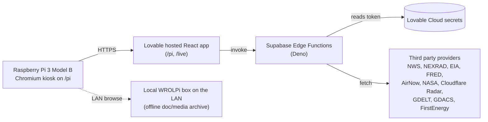

# PrepPi

A faith oriented situational awareness and preparedness dashboard built to run on a Raspberry Pi with a 7 inch touch display. It pulls live weather, grid, market, and global signals into one always on console so a household can glance at conditions without doomscrolling.

## Screenshots

| Tactical (`/pi`) | Live wall (`/live`) |
| :: | :: |
|  |  |

`/pi` is the always on layout sized for the 7 inch display (1024 by 600). `/live` is the wider read only wall view used on a desktop or second monitor.

## What this is

A personal kiosk. One screen, one household, one Pi sitting on a shelf.

## What this isn't

A product. There is no signup flow tuned for strangers, no multi tenant model, no SLA on the data feeds, and no support. Several panels depend on third party endpoints that can change shape or rate limit without warning. Treat this as a reference build, not something to deploy for other people.

## Data sources

Every panel is powered by a public or licensed feed. Credit where it's due.

| Panel | Source |
| :: | :: |
| Severe radar | NEXRAD tiles via Iowa Environmental Mesonet |
| Weather, alerts, hazardous outlook | National Weather Service (api.weather.gov) |
| Air quality | AirNow |
| Earthquakes | USGS |
| Space weather and sun imagery | NOAA SWPC plus NASA SDO |
| NASA flares, CMEs, near earth objects | NASA DONKI and NeoWs |
| Grid load and fuel mix | EIA (PJM demand) |
| Fuel prices and shipping | EIA weekly retail series plus Freightos Baltic Index |
| Financial stress | FRED (St. Louis Fed: STLFSI4, VIXCLS, T10Y2Y, MORTGAGE30US) |
| Power outages | FirstEnergy / Penelec public outage summary |
| Internet health and L7 attacks | Cloudflare Radar |
| Local scanner audio | Broadcastify (Lawrence County feed 33610) |
| Global headlines and conflict pulse | GDELT |
| Active disasters | GDACS |
| National headlines | RSS aggregation |
| Moon phase | Local computation |

## Architecture

The browser never sees a third party API key. Every credentialed call goes through an edge function that reads the token from Lovable Cloud secrets.

## Hardware setup

* Raspberry Pi 3 Model B
* Official 7 inch touch display (1024 by 600)
* MicroSD card with Raspberry Pi OS Lite plus Chromium
* Wall mount or desk stand
* Optional: a local WROLPi box on the LAN for offline reference docs

The Pi boots into Chromium kiosk mode pointed at the deployed `/pi` route.

## Tech stack

* React 18, Vite, TypeScript
* Tailwind CSS, shadcn/ui, Recharts, Leaflet
* Lovable Cloud (managed Supabase) for auth, edge functions, and secret custody
* Supabase Edge Functions in Deno proxy every credentialed third party API
* Built and deployed via Lovable

## Secrets

All third party API keys live in Lovable Cloud secrets and are referenced only from edge functions under `supabase/functions/`. The `.env` in this repo contains only the publishable Supabase URL, project id, and anon key, which are designed to be exposed to the browser. If you fork this, rotate every key on your own account.

## License

MIT. See [LICENSE](LICENSE).

## Acknowledgements

Iowa Environmental Mesonet, National Weather Service, NOAA SWPC, NASA, USGS, EIA, FRED at the Federal Reserve Bank of St. Louis, AirNow, GDELT, GDACS, Cloudflare Radar, Freightos, Broadcastify, FirstEnergy. This dashboard is a thin pane of glass over their work.
